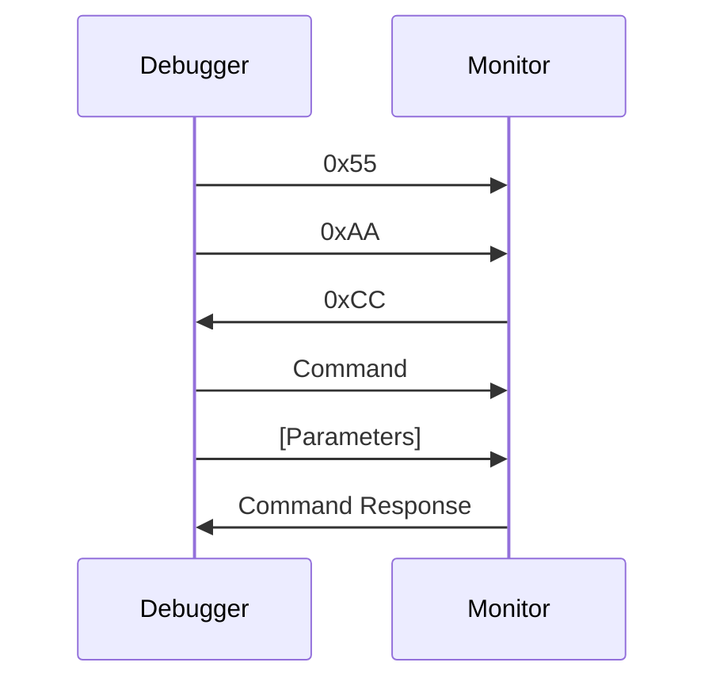

# Disassembly for the WDC W65C816SXB Single-Board Computer.

Based on original work by "Keith": https://hackaday.io/project/177384-w65c816sxb-investigation.

# Overview
The W65C816SXB is a single-board computer utilizing the W65816 microprocessor. The board has 32 KB SRAM and 128 KB flash memory. The 128 KB flash memory is partitioned into four banks, one of which is accessible at a time in the address range $8000 - $FFFF.

By default, the flash bank on powerup contains monitor code which is designed to interface with a debugger application that runs on a Windows PC. Together, the monitor code and debugger application allow you to load code, inspect and modify memory and CPU registers, set breakpoints, single-step, etc.

Very little information is publicly available about the monitor, for example, what memory locations it uses, whether it uses zero-page memory, what flash memory areas are reserved, whether it uses interrupts, what CPU mode it executes the user's application in, etc. Also, it would be nice to use this monitor code and debugging interface in other designs besides the W65C816SXB. Therefore, there are two goals for this project:

 1. Understand how the monitor works, especially in terms of what resources it uses.
 2. Have the ability to use the monitor and debugger on other hardware projects.

 # Source Overview

 There are three versions of the source code:

 ## CC65-Assembler, Factory Image Reference Version

 This CC65 version is assembled and linked with the CC65 utilities (https://cc65.github.io/). It serves as
 a reference for the byte-exact disassembly of the factory ROM image version "2.0.4.3". It uses fixed
 addresses, so it is easy to understand, and to use a reference when looking at the factory ROM image. In 
 addition to the disassembled code, there is a linker config file, and a couple of small batch files for making and cleaning the code.

 ## CC65-Assembler, Relocatble Version

 This is another CC65 version. It is relocatable by modifying the linger config file, which is useful if
 you want to modify the monitor code, or especially if you want to rebuild it to run on different hardware.
 Currently, it is configured to build an exact duplicate of the factory image.

 ## Kowalski/Richter-Assembler Version

There is a version designed to be assembed by the latest 65816-enabled version of the "6502 Macroassembler & Assembler", originally by Michael Kowalski, but enhanced by Daryl Richter to add 65816 support (https://sbc.rictor.org/kowalski.html). This version is self-contained, and does not need a linker config file.

# Debugging Interface Hardware Overview
The monitor code interacts with a W65C22S6 (VIA), which is connected to an FTDI FT245RL USB FIFO. Together, these components act like a reliable and very high-speed UART connection to the host PC, complete with flow control. This allows the debugger and monitor to communicate at a very high speed (>800 kbit/sec).

Interrupts are not used for the monitor and debugging interface, so polling is required. But, the USB FIFO supports hardware flow control, along with a fairly large FIFO, which means data transfer between the microcontroller and the host PC is reliable, even at high speeds, without interrupts.

On the PC side, the debugger (or a user's application) interacts with the monitor by either using FTDI's driver directly, or by using the virtual COM port, in which case the PC application can communicate with the monitor as if it were connected via a traditional COM port, so you can use any terminal emulator to communicate with the monitor.

# Monitor RAM Usage

* RAM is $8000 bytes in size, from `$0000-7FFF`.
* ROM monitor is $8000 bytes in size, from `$8000-$FFFF`.
* RAM locations `$7E00-$7FFF` are used (work-RAM), and unavailable to the user application.
* Zero-page locations `$00-$04` are used, but they are copied to the work-RAM, and restored
  before the application is executed, so they are available for the application to use. Note these are memory locations at physical addresses `$00-$04`, and are not affected by the `DP` register.

## Work-RAM memory locations:

### CPU Context: Starting at $7E00
The CPU context is saved in RAM starting at address `$7E00`. Whenever the monitor is asked to run the user's application, the CPU context is first restored from this area in memory, and then the user's application is invoked, starting at the address in `PC`.

|Reg|Location (LSB), (MSB)|
|---|---------------------|
|A|$7E00, $7E01		|
|X|$7E02, $7E03		|
|Y|$7E04, $7E05		|
|PC|$7E06, $7E07	|
|DP|$7E08, $7E09	|
|SP|$7E0A, $7E0B	|
|P|$7E0C			|
|E| $7E0D			|
|PB|$7E0E			|
|DB|$7E0F			|

### CPU Type: $7E10
Upon reset, the monitor code auto-detects if the installed CPU is a W65C02 or a W65816, and stores the result in this memory location.

 - 0: CPU is 65C02
 - 1: CPU is 65816

### Zero-page save area: $7E14-$7E18
Once the user's application is running, then if the monitor interrupts the application (due to a RESET or a BRK), then memory `$00-$04` is saved into this location. These addresses are then used by the monitor to communicate with the debugger, generally by storing parameters received from the debugger.

Before the user's application is executed again, these memory locations are restored from the save area in work-RAM. Therefore, although the monitor uses these memory locations, this usage is transparent to the user's application, and so the user's application is free to use this memory area.

### "Raw" Vectors
These are vectors in work-RAM, so they may be overridden by the user application, but they typically are not, because they typically perform functions necessary for the monitor and debugger to work correctly. Instead, if is reasonable for the user to handle a particular vector, then the default handler will call the user's handler through the corresponding shadow vector.

#### IRQ_02:	$7E70, IRQ Handler for 6502 Emulation Mode
Upon RESET, this vector is initialized to `IRQ_02_Entry_Vector_Default`. Since IRQ and BRK share a vector in 6502 mode, the default handler checks to see if a BRK or IRQ occurred. If an IRQ occurred, then the user's shadow vector `SHADOW_VEC_IRQ_02` is called. If a BRK was executed, the monitor breaks into the debugger with code `$02`, allowing the debugger to gain control of the machine.

#### NMI_02: $7E72, NMI Handler for 6502 Emulation Mode
Upon RESET, this vector is initialized to `NMI_02_Entry_Vector_Default`. This handler breaks into the debugger with code `$07`, allowing the debugger to gain control of the machine.

#### BRK_816: $7E74, BRK Handler for 65816 Native Mode
Upon RESET, this vector is initialized to `BRK_816_Entry_Vector_Default`. This handler breaks into the debugger with code `$02`, allowing the debugger to gain control of the machine.

#### NMI_816:	$7E76, NMI Handler for 65816 Native Mode
Upon RESET, this vector is initialized to `NMI_816_Entry_Vector_Default`. This handler breaks into the debugger with code `$07`, allowing the debugger to gain control of the machine.

### Shadow Vectors:
The shadow vectors occupy memory locations `$7EE4-$7EFF`. These vectors may be overridden by the user to handle various interrupts and CPU conditions. Upon RESET, they are all initialized to `Infinite_Loop`, address `$811F`, which does nothing forever. While there is room in this memory region for 14 shadow vectors, only some of them are used:
|Name                   |Address    |Notes
|-----------------------|-----------|---------------------------------------------------------------------
|SHADOW_VEC_COP_816     |$7EE4,$7EE5| Called when executing a COP instruction while in 65816 native mode.
|SHADOW_VEC_ABORT_816   |$7EE8,$7EE9| Called upon an ABORT signal while in 65816 native mode.
|SHADOW_VEC_IRQ_816     |$7EEE,$7EEF| Called upon IRQ when in 65816 native mode.
|SHADOW_VEC_COP_02      |$7EF4,$7EF5| Called when executing a COP instruction while in 6502 emulation mode.
|SHADOW_VEC_ABORT_02    |$7EF8,$7EF9| Called upon an ABORT signal while in 6502 emulation mode.
|SHADOW_VEC_IRQ_02      |$7EFE,$7EFF| Called upon IRQ when in 6502 emulation mode (not upon BRK).

## On RESET

* The CPU context and the first five bytes of the zero-page is saved to work-RAM.
* The emulation bit `E` in the CPU context save area is set to 1, so user programs executed will be run in emulation mode.
* The shadow registers are initialized to their default handlers.
* The entry vectors are initialized to their defaults.
* The debug VIA is initialized. This causes an $FF to be sent to the debugger.
* The monitor syncs with the debugger, where it waits for debugger commands.

## Debugger Interface:

* On RESET or NMI, `$FF` is sent from the monitor to the debugger.
* The debugger sends `$55` and then `$AA` to the debugger.
* The debugger sends `$CC` to the debugger.
* The debugger then sends a command to the debugger (0-9).
* Each command does something different, and most require extra parameters.
* The parameters are stored in the first five bytes of RAM, `$00-$04`.

## Debugger Commands:

* **Command `0`**: Send `$00` to the debugger.
Not sure why this is useful or how it is used.
	
* **Command `1`**:  Byte Sequence Test.
Debugger sends a sequence of bytes to the monitor, and the monitor sends them back. Perhaps useful for debugging or testing the debugger communication interface. See source code for details.

* **Command `2`**: Memory Write
The debugger sends 5+N bytes to the monitor:

		0: The lowest 8-bits of the 24-bit starting address.
		1: The middle 8-bits of the 24-bit starting address.
		2: The high 8-bits (bank) of the 24-bit starting address.
		3: The lowest 8-bits of the 16-bit transfer count.
		4: The highest 8-bits of the 16-bit transfer count.
		(count): The debugger sends the data to write to memory.
		
* **Command `3`**: Memory Read
The debugger sends 5 bytes to the monitor:

		0: The lowest 8-bits of the 24-bit starting address.
		1: The middle 8-bits of the 24-bit starting address.
		2: The high 8-bits (bank) of the 24-bit starting address.
		3: The lowest 8-bits of the 16-bit transfer count.
		4: The highest 8-bits of the 16-bit transfer count.
		Then the monitor sends the number of bytes requested.

* **Command `4`**: Get System Info
* The monitor sends a block of data to the debugger containing various information, like the CPU type, the work-RAM start address, the shadow vector start address, etc. See source code for details.

* **Command `5`**: Begin Program Execution
Restores CPU context and starts execution from saved values in work-RAM. This includes the entire CPU context, for example, the E(mulation) status bit, which controls if the CPU will execute in emulation mode or native mode.

* **Command `6`:** Apparent No-Op Command.

* **Command `7`:** Apparent No-Op Command.

* **Command `8`:** BRK
Executes a BRK, which sends `$02` to the debugger. Not sure why, but this is likely dead or incomplete code, which serves no useful purpose.

* **Command `9`:** Read Byte, then BRK
Reads a byte from the debugger, then performs the same action as command `8`.